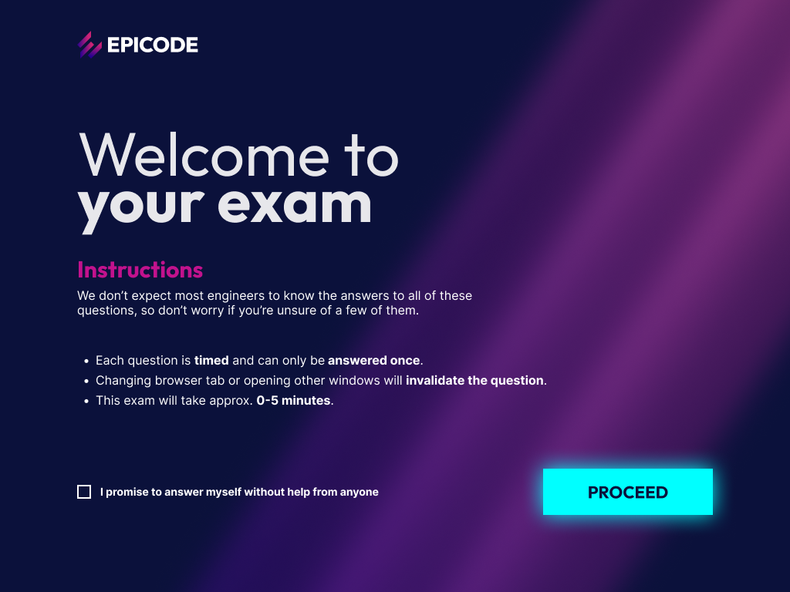
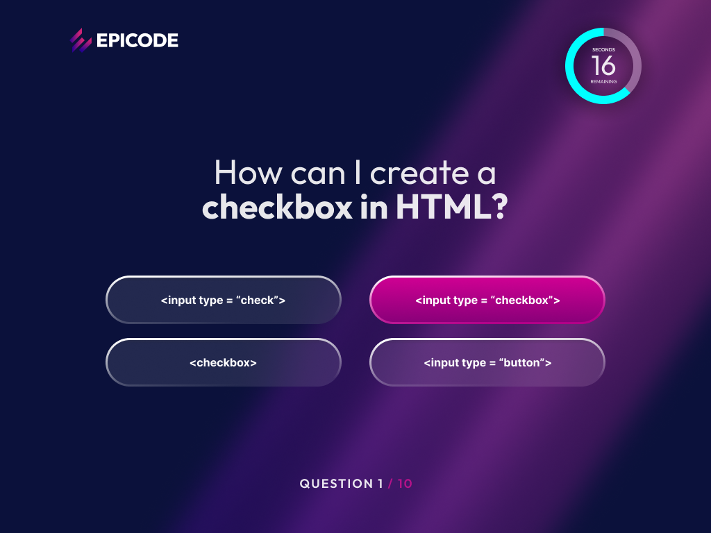

Build Week 1 
# Benchmark App — Epicode

## Descrizione del progetto

Questo progetto consiste nella realizzazione di una web app che replica un benchmark ispirato al layout di Epicode con delle funzionalità mostrate nelle reference fornite.

L’applicazione simula un esame online con timer, domande a risposta multipla o vero/falso e un sistema di navigazione completamente guidato dalla selezione della risposta.

 

# Obiettivo

Ricreare un’esperienza d’esame moderna e interattiva composta da:

1. **Pagina iniziale (Welcome Page)**
2. **Pagina del test/esame**
3. Gestione timer
4. Gestione avanzamento domande
5. Validazione del form iniziale

 

# Reference UI

## Welcome Screen

- Logo Epicode
- Titolo di benvenuto
- Istruzioni del benchmark
- Checkbox obbligatoria
- Pulsante Proceed

 

## Question Screen

- Domanda centrata
- Risposte multiple / vero-falso
- Timer di 60 secondi
- Numero domanda corrente
- Logo Epicode

 

---

# Funzionalità richieste

## 1. Welcome Page

La home iniziale deve contenere:

- Logo Epicode
- Titolo di benvenuto
- Descrizione del benchmark
- Lista delle istruzioni
- Checkbox obbligatoria:
  - l’utente conferma di:
    - essere da solo
    - non ricevere aiuto durante il test
- Pulsante “Proceed”

 

### Validazione

Il pulsante **Proceed** deve rimanere:

- disabilitato finché la checkbox non viene selezionata
- abilitato solo dopo l’accettazione della condizione

 

---

# Pagina Quiz

## Contenuto

- Una domanda alla volta
- Risposte multiple / vero-falso
- Cambio automatico domanda appena si clicca sulla risposta
- Timer di 60 secondi

 

---

# Timer

Ogni domanda:

- parte da 60 secondi
- si resetta automaticamente
- passa alla domanda successiva allo scadere del tempo

 

-----

# Appunti

CSS: Outfit & INTER FONT
@import url('https://fonts.googleapis.com/css2?family=Inter:ital,opsz,wght@0,14..32,100..900;1,14..32,100..900&family=Outfit:wght@100..900&display=swap');

font-family: "Outfit", sans-serif; // TITLE FONT
font-size: 3.75rem; // 60px; 

font-family: "Inter", sans-serif; // DESCRIPTION FONT
font-size: 1rem; // 16px;

:root {
  --accent-color: #00ffff; // BUTTON COLOR & TIMER COLOR
  --answer-button-color: #d20094; // HOVER ANSWER COLOR & onClick COLOR
  --answer-count-color: #900080; // number count color
}

L'operatore tilde in CSS ( ~ )
noto come combinatore di fratelli successivi, seleziona un elemento che segue un altro specifico elemento (condividendo lo stesso genitore).
NON richiede che l'elemento sia immediatamente successivo, ma può trovarsi ovunque più avanti nel documento

### JS: riga 101 - 106 ###
let currentQuestion = 0;
// Tiene traccia del numero della domanda che l'utente sta visualizzando, inizia da
// 0 (la prima domanda negli array JS)

let score = 0;
// Memorizza il numero di risposte corrette selezionate finora dall'utente
// Inizia da 0 e aumenta di 1 (uno) ogni volta che l'utente seleziona una risposta corretta.

let timerInterval = null;
// Questo contiene il meccanismo del timer in background, sopra in alto a destra
// Inizialmente è NULL perchè l'orologio non è ancora in funzione, finchè non viene caricata la prima domanda.

let timeLeft = 30; 
// E' il contatore in tempo reale che mosta quanti secondo mancano alla domanda apparsa e si aggiorna fino a 0

const TEMP_LIMIT = 30; // Secondi per ogni domanda
// Un tempo impostato fix che definisce il tempo massimo consentito per ogni domanda
// Essendo una CONST, questo numero non cambia mai durante l'esame

let selectedAnswer = null;
// Memorizza temporaneamente il testo della risposta su cui l'utente ha cliccato prima di procedere
// Inizia come NULL perchè non è stata ancora selezionata alcuna risposta